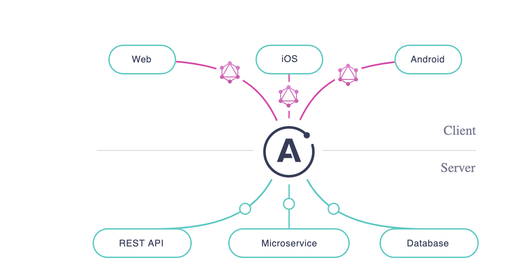
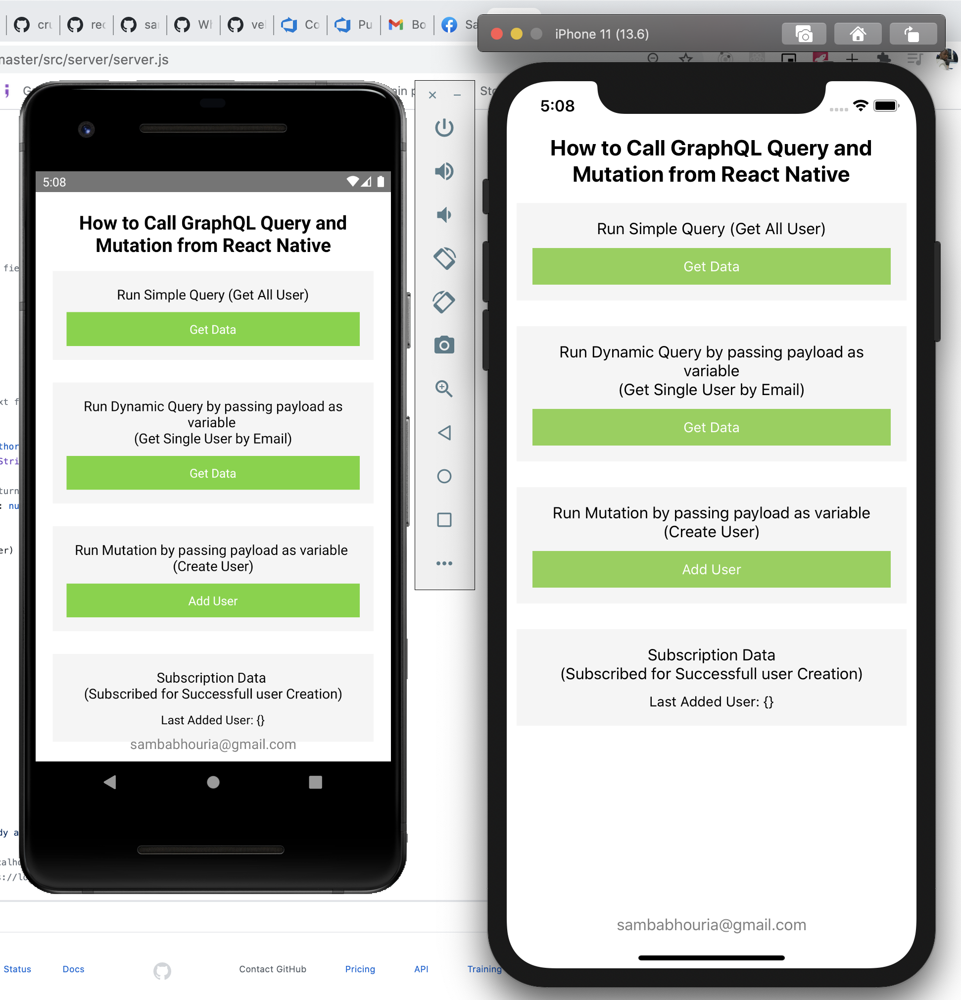
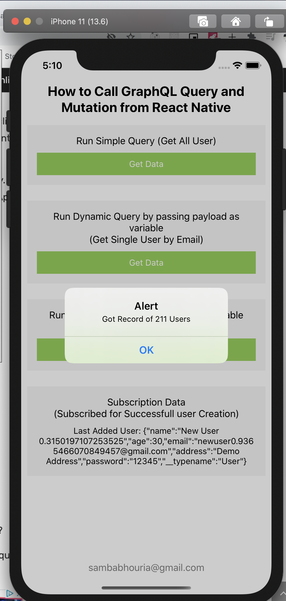
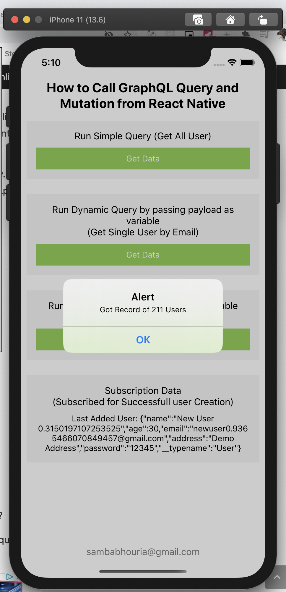
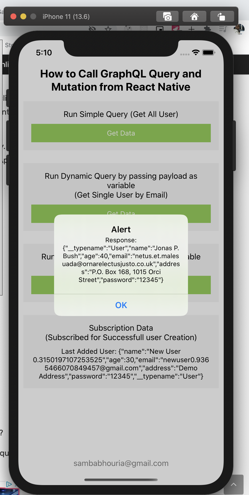
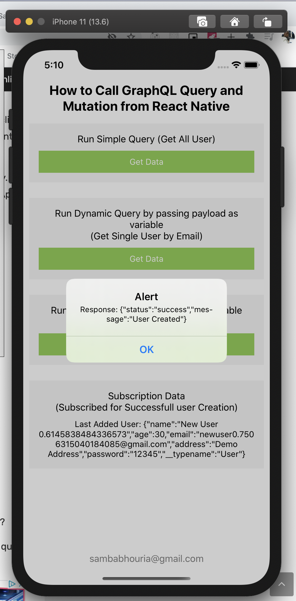

### 'Call GraphQL APIs from React Native'
An example to show how to call GraphQL Query, Mutation and Subscribe from React Native App
GraphQL is becoming the new way to use APIs in modern web and mobile apps.
GraphQL is an alternative to REST that has been steadily gaining popularity since its release
Whereas with REST a developer would usually collate data from a series of endpoint requests,
GraphQL allows the developer to send a single query to the server that describes the exact data requirement.

### 'Apollo Server and Apollo Client'
Apollo Server is an open-source GraphQL server that’s compatible with any GraphQL client, including Apollo Client.
Apollo Client helps you structure code in an economical, predictable, and declarative way.
The core @apollo/client library provides built-in integration with React, and the larger
Apollo community maintains integrations for other popular view layers.

## 'Call GraphQL Query, Mutation and Subscription
#### Query
 is used to fetch/get records. It is simply like any GET request which can take some query params to filter the records.'

#### Mutation
is used to create/update records. We can imagine it as POST / PUT / PATCH / DELETE request.
his enables your server to push updates to the subscription’s result over time.

#### Subscriptions
maintain an active connection to your GraphQL server (most commonly via WebSocket).
this enables your server to push updates to the subscription’s result over time.
Subscriptions are useful for notifying your client in real time about changes to back-end data, such as the creation of a new object or updates to an important field.

### `screenShot`

